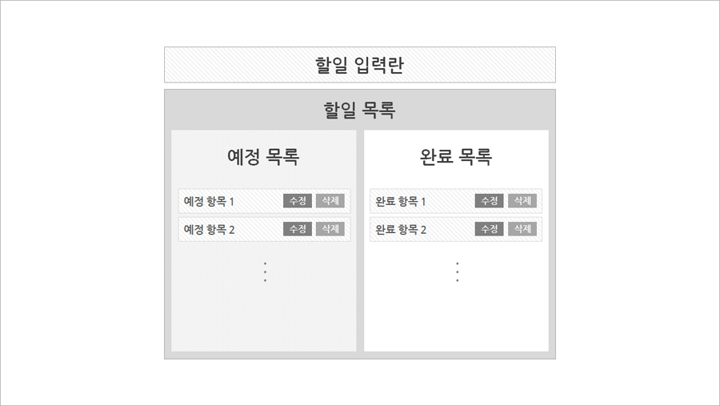

# Todo List 

## 작업 내용
1. 작업 기간 : 2018.09.11 - 
2. 작업 환경 : React 16 / create-react-app으로 초기 세팅 / ES6

## 스토리보드
- input을 통해 할일을 등록한다   
- 등록한 할일은 하단 리스트에 출력된다  
  - 할일의 상태는 '예정/완료'로 구분되며, 등록 시 예정으로 자동 등록된다
  - 리스트 우측에는 수정/삭제 버튼이 출력된다
- 수정 버튼 클릭 시, 해당 항목의 내용이 인풋으로 바뀌며 수정할 수 있다
- 삭제 버튼 클릭 시, 해당 항목이 삭제된다
- 항목 클릭 시 상태가 완료로 바뀐다 

## UI 구성

